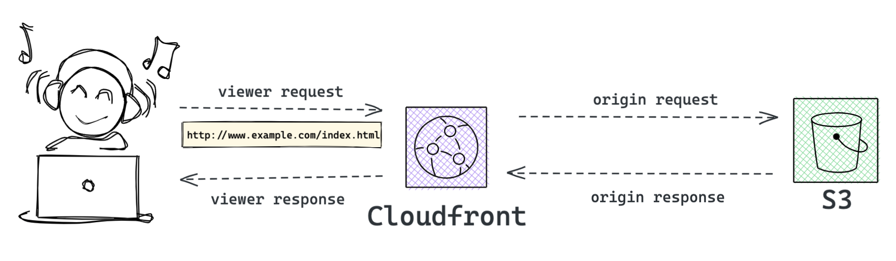
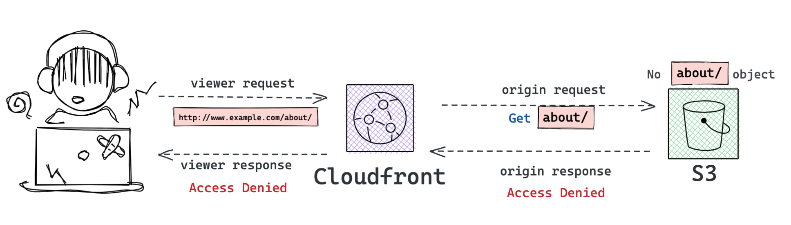
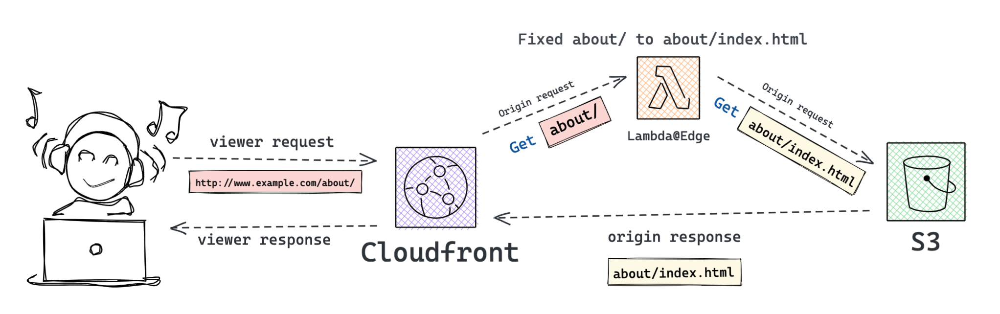

# How to Test

```sh
yarn watch
```
Open a seperate terminal and run:

```sh
AWS_REGION=us-east-1 cdk --app lib/demo/default-dir-index/index.js diff
```

On deploy completed, open the cloudfront URL with


```
http://<CLOUDFRONT_DOMAIN>/a/b/c/
```

You should be able to see `Hello CDK!`.
---

## Source idea ref from this [blog post](https://aws.amazon.com/tw/blogs/compute/implementing-default-directory-indexes-in-amazon-s3-backed-amazon-cloudfront-origins-using-lambdaedge/)


### Get `/index.html` from Cloudfront.

### Get `about/` from Cloudfront, you will get `Access Denied`, because do not have object `about/` in S3 Bucket.

### Get `about/` from Cloudfront, via `Lambda@Edge` fix `about/` to `about/index.html`
